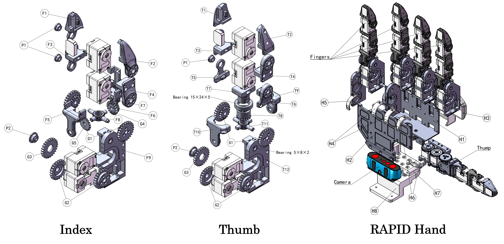

<p align="center">
    <h1 align="center"><strong>
    RAPID Hand: A Robust, Affordable,<br>
    Perception-Integrated, Dexterous Manipulation Platform<br>
    for Generalist Robot Autonomy</strong>
    </h1>
</p>

<p align="center" style="font-size:18px;">
    <a href="https://jeffreyzhaoliang.github.io/zhaoliang-wan.github.io/"><strong>Zhaoliang Wan</strong></a>
    ·
    <a href=""><strong>Zetong Bi</strong></a>
    ·
    <a href=""><strong>Zida Zhou</strong></a>
    ·
    <a href="https://hren20.github.io/"><strong>Hao Ren</strong></a>
    ·
    <a href="https://jzengym.github.io/JZENGYM/"><strong>Yiming Zeng</strong></a>
    ·
    <a href=""><strong>Yihan Li</strong></a>
    <br>
    <a href="http://luqi.info/"><strong>Lu Qi</strong></a>
    ·
    <a href="https://people.ucas.edu.cn/~XuYang"><strong>Xu Yang</strong></a>
    ·
    <a href="https://faculty.ucmerced.edu/mhyang/"><strong>Ming-Hsuan Yang</strong></a>
    ·
    <a href="https://cse.sysu.edu.cn/teacher/ChengHui"><strong>Hui Cheng</strong></a>
</p>

<h3 align="center"><a href="https://www.arxiv.org/abs/2506.07490">Paper</a> | <a href="https://rapid-hand.github.io/">Project Page</a> | <a href="https://github.com/SYSU-RoboticsLab/RAPID-Hand/tree/main/RapidTeleop">Teleoperation</a> </a></h3>

<p align="center">
    
</p>

---

## 1. Introduction

This repository provides full open-source hardware and software resources for **RAPID Hand**. It enables reproducible development and robust sensorimotor integration for manipulation.

---

## 2. Quick Start Guide

> This section walks through the end-to-end hardware setup, including 3D printing, PCB assembly, and full system integration.

### 2.1 Mechanical Assembly

Instructions are located in the `mechanical_structure/` directory, including:

- `.STL` and `.STEP` files for 3D printing
- Servo model references and mounting instructions
- Camera and base installation guide

📎 **Goal**: Physical hand structure assembled with camera mounted.

---

### 2.2 PCB Sourcing & Assembly

PCB instructions are found in the `pcb_sync_module/` directory and include:

- `BOM_Board1_PCB1.xlsx`: Bill of Materials
- `SCH_Schematic1.pdf`: Circuit schematic

📎 **Goal**: PCB modules soldered, verified, and connected to camera/tactile sensors.

---

## 3. Software Setup & Testing

This section covers environment setup, actuator calibration, camera integration, and tactile sensor verification to ensure the system is fully functional.

### 3.1 Environment Setup

Create and initialize a Conda environment named `rapid_hand_env`:

```bash
conda create -n rapid_hand_env python=3.8
conda activate rapid_hand_env
pip install -r requirements.txt
```

---

### 3.2 Dynamixel Motor Calibration

#### ⚙️ Zero-Position Calibration

1. **Close** Dynamixel Wizard if open.
2. Mount the calibration fixture and manually align fingers into a **zero (neutral) pose**.
3. Run the calibration script (replace with actual port, e.g., `/dev/ttyUSB0`):

```bash
python motor_init -p <your_motor_port>
```

4. Verify the zero position (with the calibration fixture removed):

```bash
python motor_init -p <your_motor_port> --test
```

> The hand should return to the neutral pose without joint misalignment.

#### 🤖 Gesture Test

After calibration, run a test sequence to validate motor setup:

```bash
python motion_sequence_controller -p <your_motor_port>
```

> The hand should perform predefined gestures (e.g., curling) smoothly and without collisions.

---

### 3.3 Camera Setup and Testing

#### 🧰 SDK Installation

> For detailed installation instructions, refer to the [Official Orbbec SDK Documentation](https://orbbec.github.io/pyorbbecsdk/source/2_installation/build_the_package.html)

Run the following commands to install and export the camera SDK:

```bash
cd control/rapid_hand_control/camera_port
git submodule add https://github.com/orbbec/pyorbbecsdk.git
conda activate rapid_hand_env
bash build_sdk.sh
```

> Shared libraries will be placed in `camera_sdk/` for use.

#### 🔌 Device Connection and Test

Connect the Orbbec camera via **USB 3.0** for reliable transmission. Run:

```bash
python hello_orbbec.py
```

Expected terminal output:

```txt
Hello Orbbec!
SDK version: 2.3.5
Device info: DeviceInfo(name=Orbbec Gemini 335, ...)
```

#### 🔐 Serial Number Configuration

Copy the `serial_number` from the output above and insert it into:

```json
// rapid_hand_control/camera_port/multi_device_sync_config.json
"devices": [
  {
    "serial_number": "YOUR_SERIAL",
    "config": {
      "mode": "HARDWARE_TRIGGERING"
    }
  }
]
```

---

### 3.4 Tactile Sensor Visualization

Run the following script to monitor tactile feedback in real-time:

```bash
python tactile_visualizer -p <your_serial_port>
```

> Use this to verify the sensor layout and ensure signal consistency across all fingers.

---

## 4. FAQ & Troubleshooting

Common issues and suggested checks:

- **Motor not responding** → Check power supply and USB permissions
- **No tactile signal** → Confirm sensor wiring and PCB soldering
- **PCB not powering up** → Check voltage and shorts across power lines
- *(Feel free to contribute more entries!)*

---

## Citation

```bibtex
@article{wan2025rapid,
  title={RAPID Hand: A Robust, Affordable, Perception-Integrated, Dexterous Manipulation Platform for Generalist Robot Autonomy},
  author={Wan, Zhaoliang and Bi, Zetong and Zhou, Zida and Ren, Hao and Zeng, Yiming and Li, Yihan and Qi, Lu and Yang, Xu and Yang, Ming-Hsuan and Cheng, Hui},
  journal={arXiv preprint arXiv:2506.07490},
  year={2025}
}
```

---

## License

This project is licensed under the [Creative Commons BY-NC-SA 4.0 License](http://creativecommons.org/licenses/by-nc-sa/4.0/).

---

## Acknowledgements
