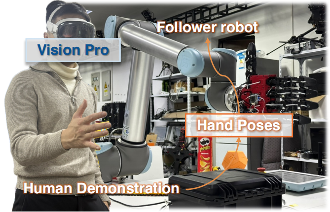
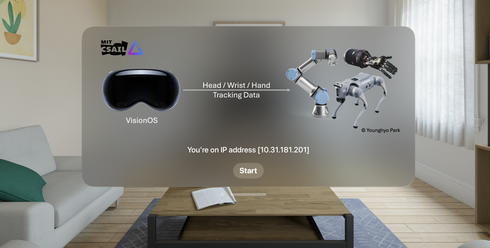

<p align="center">
    <h1 align="center"><strong>
    RAPID Hand: A Robust, Affordable,<br>
    Perception-Integrated, Dexterous Manipulation Platform<br>
    for Generalist Robot Autonomy</strong>
    </h1>
</p>

<p align="center" style="font-size:18px;">
    <a href="https://jeffreyzhaoliang.github.io/zhaoliang-wan.github.io/"><strong>Zhaoliang Wan</strong></a>
    ·
    <a href=""><strong>Zetong Bi</strong></a>
    ·
    <a href=""><strong>Zida Zhou</strong></a>
    ·
    <a href="https://hren20.github.io/"><strong>Hao Ren</strong></a>
    ·
    <a href="https://jzengym.github.io/JZENGYM/"><strong>Yiming Zeng</strong></a>
    ·
    <a href=""><strong>Yihan Li</strong></a>
    <br>
    <a href="http://luqi.info/"><strong>Lu Qi</strong></a>
    ·
    <a href="https://people.ucas.edu.cn/~XuYang"><strong>Xu Yang</strong></a>
    ·
    <a href="https://faculty.ucmerced.edu/mhyang/"><strong>Ming-Hsuan Yang</strong></a>
    ·
    <a href="https://cse.sysu.edu.cn/teacher/ChengHui"><strong>Hui Cheng</strong></a>
</p>

<h3 align="center"><a href="https://www.arxiv.org/abs/2506.07490">Paper</a> | <a href="https://rapid-hand.github.io/">Project Page</a> | <a href="https://github.com/SYSU-RoboticsLab/RAPID-Hand/tree/main/RapidHandHardware">Hardware Design</a> </a></h3>

<p align="center">
    
</p>

## 1. Introduction

This repository implements the teleoperation interface and control stack for the **RAPID Hand**. It enables real-time control of the robotic hand using motion data streamed from Vision Pro.

---

## 2. Installation & Setup Guide

### 2.1 Software selection -- OS

Currently tested and working configurations:

- ✅ Ubuntu 18.04 + ROS 1 melodic
- ✅ Ubuntu 20.04 + ROS 1 noetic

---

### 2.2 Software installation – ROS

This project relies on **ROS (Robot Operating System)** for inter-module communication.
Please install a compatible ROS distribution based on your operating system **before** building or running the code.

| Recommended Setup                         | Installation Guide                                                          |
| ----------------------------------------- | --------------------------------------------------------------------------- |
| **ROS 1 – Melodic** (Ubuntu 18.04) | [wiki.ros.org/melodic/Installation](https://wiki.ros.org/melodic/Installation) |
| **ROS 1 – Noetic** (Ubuntu 20.04)  | [wiki.ros.org/noetic/Installation](https://wiki.ros.org/noetic/Installation)   |

> For other ROS versions (e.g., Foxy, Iron, Rolling) or different operating systems, please refer to the official docs at [docs.ros.org](https://docs.ros.org).

Once installed, make sure to add the following line to your shell configuration file (e.g., `.bashrc`) to automatically load ROS environment variables:

```bash
source /opt/ros/<distro>/setup.bash  # Replace <distro> with your ROS distribution name
```

This ensures you can run `ros*` or `ros2*` commands in new terminal sessions.
If you encounter any ROS-related issues, first verify that your ROS environment is properly installed and sourced.

---

### 2.3 Software installation – Conda

```shell
  conda create -n rapid_teleop python=3.8
  conda activate rapid_teleop
  pip install -r requirements.txt
```

---

### 2.4 Hardware installation

#### 2.4.1 Dynamixel Motor setup

> 🛠 **Before you begin:**
> Make sure to identify your motor's serial port (e.g., `/dev/ttyUSB0`) and update it in the configuration file:
>
> ```yaml
> # File: args/robot_args/hand_args/rapid_args.yaml
> motor_port: /dev/ttyUSB0
> ```

**Calibrate the zero position**

- Before proceeding, **make sure Dynamixel Wizard is closed** and the software environment is fully set up.
- Mount the **calibration fixture** on the robotic hand and place the fingers in their intended **zero (neutral) pose**.
- Run the following command to record the current position of each motor as its **default (zero-radian) position**:

  ```shell
  # Replace <your_motor_port> with your actual device path, e.g., /dev/ttyUSB0
  python -m utils.motor_init -p <your_motor_port>
  ```
- Then verify the calibration by running:

  ```shell
  python -m utils.motor_init -p <your_motor_port> --test 
  ```

  This command sets all joint angles to zero. Visually check that the hand moves into the correct neutral pose without misalignment.

Once all motors have been installed and zeroed, run the following command to test the motor configuration:

```shell
python -m utils.motion_sequence_controller -p <your_motor_port>
```

If the robotic hand can perform preset gestures such as finger curling without any collisions or unnatural motion, the assembly and motor configuration are correct.

---

#### 2.4.2 Camera installation

> For detailed installation instructions, refer to the [Official Orbbec SDK Documentation](https://orbbec.github.io/pyorbbecsdk/source/2_installation/build_the_package.html)

**🔧 Step 1: Build and Install the Orbbec SDK**

Run the following commands to install and export the camera SDK:

```bash
cd control/rapid_hand_control/camera_port

# Add the SDK repository as a submodule (only required once)
git submodule add https://github.com/orbbec/pyorbbecsdk.git

# Activate the environment and build the SDK
conda activate rapid_teleop
bash build_sdk.sh
```

Once the build is complete, the generated shared libraries will be automatically copied to the `camera_sdk/` directory for use by the project.

**📷 Step 2: Connect the Camera and Run a Test**

Ensure the camera is properly connected to the host machine via a **USB 3.0 interface** to guarantee stable data transmission.

> To verify the connection or test the device functionality, you can use the official tool [OrbbecViewer](https://github.com/orbbec/OrbbecSDK).

After connecting the camera, run the test script:

```python
python hello_orbbec.py
```

If the SDK is installed successfully, the terminal will display output similar to:

```txt
Hello Orbbec!
SDK version: 2.3.5
Device info: DeviceInfo(name=Orbbec Gemini 335,
serial_number=CP15641000AB,
...)
```

**🧩 Step 3: Configure the Serial Number**

Copy the `serial_number` from the output and fill it into the configuration file `multi_device_sync_config.json`:

```json
// control/rapid_hand_control/camera_port/multi_device_sync_config.json
"devices": [
  {
    "serial_number": "",
    "config": {
      "mode": "HARDWARE_TRIGGERING"
    }
  }
]
```

---

#### 2.4.3 Tactile Verification

> 🛠 **Before you begin:**
> Identify the serial port used by your tactile PCB (e.g., `/dev/ttyCH341USB0`) and update the configuration:
>
> ```yaml
> # File: args/robot_args/hand_args/rapid_args.yaml
> pcb_port: /dev/ttyCH341USB0
> ```

You can visualize tactile data in real time, by running:

```shell
# Replace <your_serial_port> with your actual device path, e.g., /dev/ttyUSB0
python -m utils.tactile_visualizer -p <your_serial_port>
```

Using the serial terminal or the visualization script, you can identify the order of tactile data from each finger.
To ensure a consistent and standardized order during runtime—index, middle, ring, little, thumb—update the following mapping in the configuration file:

```yaml
# File: args/robot_args/hand_args/rapid_args.yaml
# Map tactile signals in the exact order they arrive.
# For example, if the first signal comes from the little finger (LDIP), set LDIP to 0, and so on.
tactile_order_dict:
  IDIP: 0  # Index finger
  MDIP: 3  # Middle finger
  RDIP: 1  # Ring finger
  LDIP: 2  # Little finger
  TDIP: 4  # Thumb
```

This configuration ensures the tactile data stream is correctly interpreted and remains consistent across all modules.

---

#### 2.4.4 VisionPro Configuration

1. Ensure that your host machine and the Vision Pro device are connected to the same Local Area Network (LAN).
2. Download and install the [Tracking Streamer app](https://github.com/Improbable-AI/VisionProTeleop) on your Vision Pro device.
3. Launch the Tracking Streamer app and take note of the IPv4 address displayed on the screen.
4. Open the `visionpro.yaml` configuration file and update the `avp_ip` field with the IP address you just noted:

```yaml
# args/inputstream_args/visionpro.yaml
input_stream_type: visionpro
avp_ip: 192.168.1.100
```

---

## 3. Teleoperation Test

This section guides you through running the ROS-based teleoperation system. The pipeline streams motion data from Vision Pro and supports controlling both a simulated and a real robotic hand (UR10 + RAPID Hand).

### 🔧 3.1 Start Tracking Streamer on Vision Pro

On your Vision Pro device, open the **Tracking Streamer** app and tap **Start** to begin streaming motion data.



---

### 📡 3.2 Start ROS Core

```bash
roscore
```

ROS is the middleware that allows communication between all modules.

---

### 🧠 3.3 Launch the Teleoperation Node

```bash
python teleop_node.py
```

This node:

- Loads settings from `args/teleop_args.yaml`,
- Converts Vision Pro or glove motion input into robot joint commands using `TeleopProcessor`,
- Publishes joint commands to `/teleoperation/joint_angles`.

✅ **ROS topic published:**

```yaml
joint_command_topic: /teleoperation/joint_angles  # in teleop_args.yaml
```

---

### 🧪 3.4 (Optional) Launch the Simulator

```bash
python sim_node.py
```

Runs a real-time Sapien simulator that mirrors the teleoperation motion:

- Loads the robot URDF model,
- Subscribes to `/teleoperation/joint_angles`,
- Applies the motion in simulation.

Great for **visual debugging** or **testing without hardware**.

---

### 🤖 3.5 (Optional) Launch the Real Robot Node

```bash
python robot_node.py
```

This node drives the **UR10 arm** and **Rapid Hand**:

- Subscribes to `/teleoperation/joint_angles`,
- Sends real-time joint commands to the physical devices.

It can also:

- **Publish sensor data** to ROS topics,
- **Save robot data** for experiments (optional).

🗂️ **Key config entries in `teleop_args.yaml`:**

```yaml
# File: args/teleop_args.yaml
publish_config:
  publish_robot_data: true        # Whether to publish robot data to ROS topics in real time
  robot_data_topic:
    joint_topic: /robot2/joint_states            # Topic to publish robot joint angles (UR10 + Rapid Hand)
    rgb_image_topic: /camera_image               # Topic to publish RGB camera images from the hand
    tactile_topic: /tactile_data                 # Topic to publish raw tactile sensor values
    tactile_image_topic: /tactile_image          # Topic to publish 2D tactile heatmaps (image format)
    tactile_point_cloud_topic: /tactile_point_cloud  # Topic to publish 3D point cloud from tactile sensors

save_config:
  save_robot_data: False         # Whether to save robot sensor data to disk during teleoperation
  root_dir: ./data               # Root directory to store data if saving is enabled
  task_dir: test_data            # Subfolder name under root_dir to organize the current experiment's data

```

---

## Citaton

```bibtex
@article{wan2025rapid,
  title={RAPID Hand: A Robust, Affordable, Perception-Integrated, Dexterous Manipulation Platform for Generalist Robot Autonomy},
  author={Wan, Zhaoliang and Bi, Zetong and Zhou, Zida and Ren, Hao and Zeng, Yiming and Li, Yihan and Qi, Lu and Yang, Xu and Yang, Ming-Hsuan and Cheng, Hui},
  journal={arXiv preprint arXiv:2506.07490},
  year={2025}
}
```

---

## Licence

This project is licensed under the [Creative Commons BY-NC-SA 4.0 License](http://creativecommons.org/licenses/by-nc-sa/4.0/).

---

## Acknowledgements
